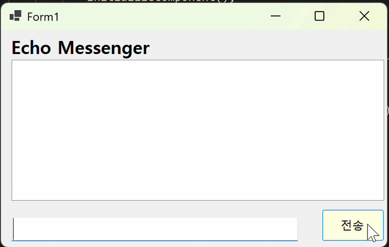
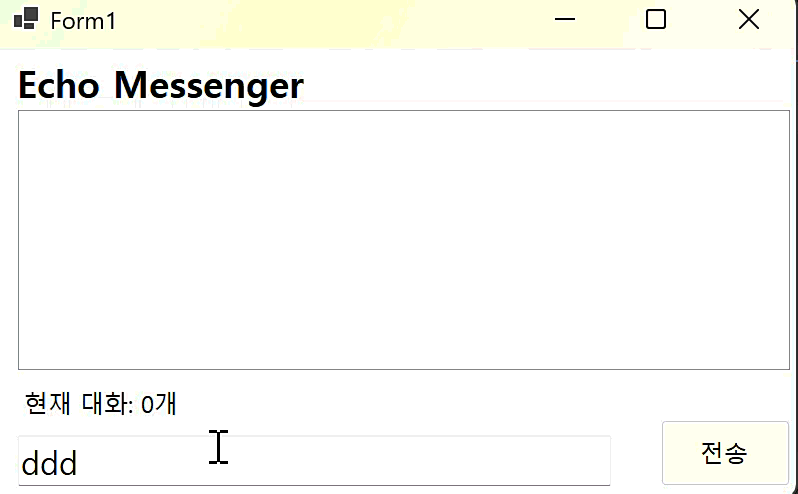

# (C# 코딩) 에코 메신저
## 개요
- C# 프로그래밍 학습:WinForms를 이용한 이벤트 기반 프로그래밍 및 UI 구성 원리 습득
- 핵심기능: 메시지 전송, 실시간 타임스탬프 결합, 데이터 유효성 검사(50자 제한), 리스트 관리(선택 삭제 및 전체 초기화)
- 화면구성: ListBox(대화창), TextBox(입력창), Button(전송/삭제/초기화), Label(상태 표시)

## 실행 화면

 - 1단계 코드의 실행 스크린샷
- 텍스트박스의 내용을 리스트박스에 추가하는 기본 로직 구현

- 2단계 코드의 실행 스크린샷
- 빈 메시지 전송 차단 및 KeyDown 이벤트를 이용한 엔터키 전송 편의성 강화
- 

 - 3단계 코드의 실행 스크린샷
 - DateTime. Now를 활용한 시간 표시 및 문자열 보간법($) 적용, 대화 개수 실시간 업데이트
- 

 - 4단계 코드의 실행 스크린샷
 - 선택 항목 삭제 시 예외 처리(MessageBox), 전체 기록 초기화, 50자 입력 제한 로직 적용
- 

## 배운 내용
1. **이벤트 핸들러 활용**: Click, KeyDown 등 사용자 액션에 따른 이벤트 처리 방식 이해했습니다
2. **데이터 유효성 검사**: `Trim()`, `IsNullOrWhiteSpace()`, `Length` 속성을 이용한 방어적 프로그래밍 실습했습니다.
3. **WinForms 컨트롤 제어**: ListBox, TextBox, Label 등 다양한 컨트롤의 속성과 메서드 활용 능력을 키웠습니다.
4. **Git 버전 관리**: 기능 단위별 커밋(Commit)과 푸시(Push)를 통한 프로젝트 형상 관리 경험을 할 수 있었습니다.